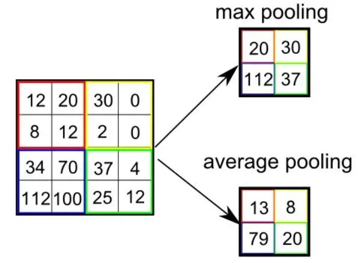
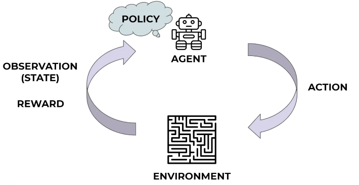

# Note
For ET robot contest 2024

## Hardware & Protocol
Description of the hardware of Raspberry Pi, LEGO Spike Prime Hub, and the protocols used for communication between them.

### GPIO(General-Purpose Input/Output)
A GPIO (general-purpose input/output) port handles both incoming and outgoing digital signals. This is a powerful feature of the Raspberry Pi which has 40-pin GPIO headers on the board as shown in below.
[](https://www.raspberrypi.com/documentation/computers/raspberry-pi.html)

Here we use the ports `GPIO 12(PWM0)` and `GPIO 13(PWM1)` for the **serial communication**(A communication method that uses one or two transmission lines to send and receive data, and that data is continuously sent and received one bit at a time).

Port name for Raspberry Pi:

| Name | Description |
| --- | --- |
| dev/ttyACM0 | USB port |
| dev/ttyAMA1 | Serial port |

### UART(Universal Asynchronous Receiver / Transmitter)
An asynchronous serial communication protocol for sending serial data over USB or via *TX/RX* pins. The micropython package `uasyncio` implements the asynchronous I/O with `UART` which in here are used for controlling LEGO Spike Prime Hub devices such as motors or sensors.

* `Baud Rate`: The baud rate is the rate at which information is transferred in a communication channel. E.g, "9600 baud" means that the serial port is capable of transferring a maximum of 9600 bits per second.

!!! note "About the usage of `uasyncio`(`asyncio` for python)"

    The statement `await asyncio.sleep(0)` will allow other tasks to run without blocking the current task for any significant amount of time. For the following code, the function will keep displaying the current time for 1 second. If you comment out the line `await asyncio.sleep(0)`, the function will keep running without termination.

```python
import asyncio
import datetime

async def display_time():
    loop = asyncio.get_running_loop()
    while True:
        print(datetime.datetime.now())
        await asyncio.sleep(0)  # function will never stop if you comment out this line

async def main_task():
    asyncio.create_task(display_time())
    await asyncio.sleep(1)     # run for 1 second

asyncio.run(main_task())
```

### Implementation
An asynchronous connection between Raspberry Pi and SPIKE Prime Hub is implemented for sending commands between them. For Raspberry Pi, two GPIO ports are configured for UART communication. Regarding the SPIKE Prime Hub, it will run a MicroPython script and act as a server to send/receive data with Raspberry Pi through `uasyncio` (the interval time is 10 milliseconds). The steps for overriding the default behavior of the SPIKE Prime Hub, see [here](https://github.com/ETrobocon/RasPike/wiki/spike_setup)

---

## Convolutional Neural Network(CNN)
The Convolutional Neural Network (`ConvNet/CNN`) architecture typically contains three layers: a *convolutional layer*, a *pooling layer* and a *fully connected layer*.  

### Convolutional Layer
The layer performs a dot product between the `kernel` and the corresponding area of the image. When the input image has more than one channel, the kernel will also need to be extended up to the same depth. The kernel convolutely moves from the left to the right for the input image with certain step(`stride`). For some cases, we need to augment the input image to a larger size, the technique is called `padding`. In the below example, the `stride` value equals to 1 and no `padding` is applied.  


* For more demostration, could be found at [here](https://github.com/vdumoulin/conv_arithmetic)

### Pooling Layer
Same as Convolutional Layer, `Pooling Layer` acts as role of reducing the dimensionality of the input image and retaining the crucial informations. There are serveral pooling functions. The following example show the mechanism of of `Max Pooling` and `Average Pooling`.  

[](https://saturncloud.io/blog/a-comprehensive-guide-to-convolutional-neural-networks-the-eli5-way/)

### Fully Connected Layer
A series of `linear layer` being used to extract specific information from the pooling layer outputs.   

---

## Deep Q-Learning(DQN)
A state-action-reward-state-action form of reinforcement learning algorithm.

### 1. Theory
Reinforcement learning (RL) is the part of the machine learning ecosystem where the **agent** learns by interacting with the **environment** to select the optimal **actions** for the every **states** that could received the highest **rewards**.



The concept of **Q Learning** is that, for the given environment we can project the best *action* corresponding to the observation(*state*) into a state-action table which called the **Q Table**. Therefore, the training process can also be described as the process that train the agent(update its policy table) to get the higher **rewards**.

### 2. Target Q
If an environment has a discrete state space and a discrete set of actions, it is possible to create a grid or table that matches all possible *actions* at all possible *states*. The table was called the **Q Table**. And then we could assign an expected reward to each possible action at each possible state: 

$$\tag{2.1} Q(s,a)=E[r]$$

Where $Q(s,a)$ is the long term expected reward for a particular action at a particular state, $s$ represents the *state* and $r$ represents the *action*, respectively. Therefore, the *rewards* at the time step of $r$ can be described as

$$\tag{2.2} Q(s_t,a_t)=r_{t+1}+r_{t+2}+r_{t+3}+... $$

Where $r_{t+1}, r_{t+2}...$ are the corresponding *rewards* at the specific time step, the $r_{t+1}$ could also refer as the instant rewards. Because the further rewards are trying to be calculated, the less certainty they will have. To deal with this issue, we add an adjustment term to indicate that the less certainty for the future rewards. Where $\gamma$ is called the **discount rate**

$$\tag{2.3} Q(s_t,a_t)=r_{t+1}+\gamma r_{t+2}+\gamma^2 r_{t+3}+...$$

A lower $\gamma$ makes rewards from the uncertain far future less important for our agent than the ones in the near future that it can be fairly confident about. By doing some mathematical stuff, we can rewrite the formula as

$$\tag{2.4} Q(s_t,a_t)=r_{t+1}+\gamma Q(s_{t+1},a_{t+1})$$

To reflecting our goal that using an action **a** to obtain the **max Q** at State **t+1**. The final **Q-target equation** will be

$$\tag{2.5} Q(s_t,a_t)=r_{t+1}+\gamma \max_{a} Q(s_{t+1},a)$$

* Regarding the dimension of **Q Table**, if a environment has 2 actions, 2 observations for the state, 1 of the observation has 3 potential values and the another observation has 4 potential values. Therefore, each of the state will be a $3*4*2$ shape array.

### 3. Learning Process
To obtain the optimal **Q**, the training process(updating $Q$) can be described as

$$\tag{3.1} Q_{new} \leftarrow Q_{current} + \alpha error$$

Where $\alpha$ represents the *learning rate*, the $error$ equals $Q_{target}-Q_{current}$, respectively. The symbol $\larr$ indicates that the $Q_{current}$ will then be updated to $Q_{new}$. By plugging the error($\alpha$) to equation (5), we can get

$$\tag{3.2} Q_{new} \leftarrow Q_{current} + \alpha [Q_{target}-Q_{current}]$$

Swap the $Q_{target}$ with equation (4) and $Q_{current}$ with $Q(S_t,A_t)$, the final form of Q-learning will be the following form which is called the **Bellman's equation**

$$\tag{3.3} Q_{new} \leftarrow Q(s_t,a_t) + \alpha [r_{t+1}+\gamma \max_{a} Q(s_{t+1},a)-Q(s_t,a_t)]$$

* Where $\alpha$ represents the *learning rate*, $\gamma$ represents the *discount rate*, respectively.

### 4. Epsilon & Decay
**Exploitation** means utilizing the current knowledge or exploiting the *learned policy* to maximize the expected rewards.  
**Exploration** means selecting *random* actions in order for the agent to discover *new* or better ways.

Exponential decay formula:

$$\tag{4.1} N(t)=N_{0}e^{-\lambda t}$$

* Where $N_{0}$ is the initial value and $\lambda$ is a constant called *decay constant*.

#### 4.1 Epsilon
Aka **epsilon greedy policy**. In reinforcement learning, in order to determine whether to exploration or exploitation, an hyperparameter called **epsilon** was introduced. The value decide whether the max Q value will be used, or choose a random action instead. 

#### 4.2 Decay
**decay** of epsilon: slowly reduce random exploration as training continues. slower decay means slower learning, since more random actions will be taken.

### 5. Deep Q Network(DQN)
Q Learning builds a **Q Table** of State-Action values $Q(s,a)$, but in a real-world scenario, the number of **states** could be too enormous to compute. Therefore, insteading of using a **Q Table**, we use a neural network which called **Deep Q Network** to represents the **Q Table**. The neural network maps a **state** to the **Q values** of all the *actions* that can be taken from that state.

However, Deep Q Network(DQN) training process suffers from instability, the below techniques are introduced.
* Experience Replay
* Double Deep Q Learning(for calculating the **Target Q**)
* Fixed Q-Target neural network

#### 5.1 Bellman’s Equation for DQN
In DQN, Bellman’s equation has the following shape now

$$\tag{5.1} Q(s,a;\theta) \leftarrow r_{t+1}+\gamma \max_{a^{'}} Q(s^{'},a^{'}; \theta^{'})$$

Where the $Q(s,a;\theta)$ represents the **policy Q network** with the weights of $\theta$, $Q(s^{'},a^{'}; \theta^{'})$ represents the **target Q network** with the weights of $\theta^{'}$, $\gamma$ is the **discount rate**. Then we can introduce a loss function by calculating the error between the $Q(s,a;\theta)$ and the equation (10) to optimize the **policy Q network**. 
* The neural network projects all the **states** corresponding to the each **actions** to its maximum **rewards** are assumed to obtain.
* Because the **instant rewards** have a higher impact on **expected future rewards**, as the training process continues, the closer between the **expected future rewards** and the **real future rewards** will be.

#### 5.2 Experience Replay
When training the neural network, we generally take a batch of dataset and shuffling it to make sure the dataset have low variance, otherwise the neural network would **never converge**. In the other hand, if we take the training data from a previous sequential actions, the neural network will then only confine to a particular scenario which is meaningless(aka **catastrophic forgetting**). So the solution is, for every training step, we create a *memory pool* that saves all actions have taken. In the further training step, we will take a random batch of dataset in the memory pool, this could not just make sure the dataset have enough diversity but utilize the previous experience.

#### 5.3 Fixed Q-Target neural network
Based on the `Bellman’s equation(7)`, we need a **Policy Q network** and a **Target Q network** to training the DQN. But the problem is the **Policy Q netword**'s weight get updated at every time step, this can lead to significant *oscillation* in training process because of the loss function keeps shifting. To solve the problem, we freeze the **Target Q network** for a peroid of time(such as a couple of training batch loops or a specific training episodes) while updating the **Policy Q network** that can stablize the **expected Q value(4)** therefore the **Policy Q network** become trainable. The following code shows an example to initialize two identical neural networks in pytorch.  

```python
policy_net = DQN(n_observations, n_actions).to(device)
target_net = DQN(n_observations, n_actions).to(device)
target_net.load_state_dict(policy_net.state_dict())
```

## Reference
* [LEGO MINDSTORMS Inventor Hub API Documentation](https://lego.github.io/MINDSTORMS-Robot-Inventor-hub-API/index.html)
* [MicroPython uasyncio](https://docs.micropython.org/en/v1.14/library/uasyncio.html#)
* [A Comprehensive Guide to Convolutional Neural Networks — the ELI5 way](https://saturncloud.io/blog/a-comprehensive-guide-to-convolutional-neural-networks-the-eli5-way/)
* [The PI-Mobile, an autonomous car made with Lego, RaspberryPi and Deep Learning](https://paulgrn.medium.com/the-pi-mobile-an-autonomous-car-made-with-lego-raspberrypi-and-deep-learning-629426feadbc)
* [Reinforcement Learning Explained Visually (Part 5): Deep Q Networks, step-by-step](https://towardsdatascience.com/reinforcement-learning-explained-visually-part-5-deep-q-networks-step-by-step-5a5317197f4b)
* [The Deep Q-Learning Algorithm](https://huggingface.co/learn/deep-rl-course/unit3/deep-q-algorithm)
* [Introduction to Reinforcement Learning. Part 3: Q-Learning with Neural Networks, Algorithm DQN](https://markelsanz14.medium.com/introduction-to-reinforcement-learning-part-3-q-learning-with-neural-networks-algorithm-dqn-1e22ee928ecd)